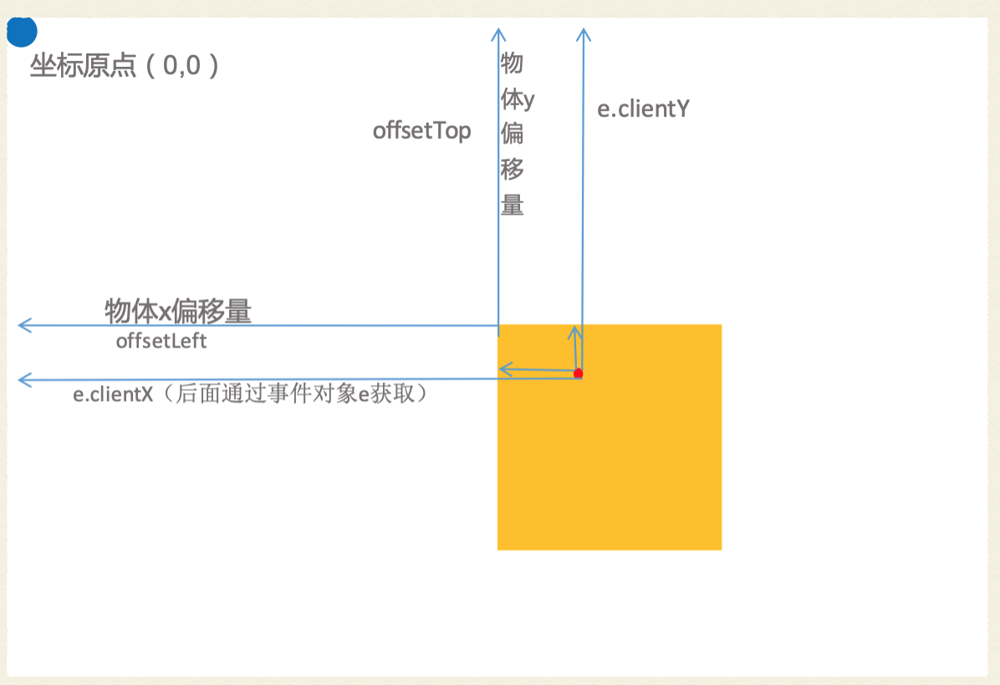

前端训练营

> 正课开始之前 做一些前置知识铺垫
>
> 做一些各种知识点的练习 以及重点难点的提前渗透
>
> 扩展一些知识

```
vnc viewer 广播屏幕的软件
 下载地址：https://www.realvnc.com/en/connect/download/viewer/
vscode  前端开发 代码编辑器
 下载地址：https://code.visualstudio.com/
 chrome浏览器 devTool 前端代码调试以及预览
```


##### 前几天的课程

##### 第一天内容

```js
1. html常用标签
2. form表单标签
3. 表格标签
4. 学生信息表/ 信息表form表单练习
5. 网易小练习 类似选项卡案例（结构 + 一点js）
6. 移动端网上药房的布局 （html+css）
```

##### 第二天内容

```js
移动端网上药房的布局 （html+css）
移动端如何适配 rem  flex-box 
弹性盒的链接 青蛙往荷叶上跳 游戏网站24关---->练习布局方式
     flex练习游戏网站: https://flexboxfroggy.com/
移动端网上药房 px像素==>rem 

HTML5(section header footer ... audio video canvas) 
CSS3 (阴影 圆角 倒影  transition transform @keyfarme xxx {})
html4 + css2 

H5 + CSS3 + Javascript 三大基本技术
vue. 小程序(微信小程序 跨端技术uniapp/taro)  react  nodejs 工程化构建 webpack/vite/rollup/gulp/grunt
```

##### 第三天内容

```js
1. 图片时间案例
   img + js（获取当前系统时间 ===> 图片对应） + 定时器setInterval()
2. 擦出图片小案例
   js动态生成100个div （定位 left top 循环中找规律）
   每个div添加背景--->背景定位background-position
3. 立方体 
    css3 transform: translate位移+ rotateX() rotateY() 
    关键帧动画 @keyframe xxx {} animation: xxx 2s linear infinte
4. 祝愿墙 （js阶段 综合）
   静态布局 + js功能 （1 循环数据 生成一堆纸条 放到页面里 2 添加删除功能， 3 点击纸条提高层级 显示到最前面 调z-index属性）
```

##### 第四天内容

```js
1. 立体照片案例
   css3 相关知识
   nth-child 选择每一个图片
   rotateY()  translateZ() 
   关键帧动画
   
2. 综合布局案例
   移动端酷狗案例
```

##### 第五天内容

###### 常用布局标签 以及分类特点

```js
 分类：
        块级元素 block:
          h1~h6 p  div header footer section
          main article aside nav ul ol dl dt dd li form
           
        行内元素inline : 
            span a  i  strong em b 
        行内块元素inline-block ： 
             img input button
        table类型：
             table标签  ====> 块级元素
        table-cell单元格类型：   
             td th

        flex:  弹性盒


        块级元素：
           独占一行 
           默认宽度和父级元素一样 撑开 100% 
           高度为0  由内容撑开
           可以直接设置宽高width  height
           可以设置margin 和 padding
        行内元素：
            允许和其他元素并列一排
            宽度和高度默认为0  由内容撑开
            不能设置宽度高度（不生效）
            不能设置上下margin 上下padding
        行内块元素：
            允许和其他元素并列一排
            默认宽度和高度由元素默认样式决定  button input
            可以设置宽度和高度
            默认会有一个空隙 （空白换行 默认解析为一个空隙）
            
 块级元素和行内元素的区别--面试常问的问题
```

###### 浮动布局

```css
float: left | right;
一、为什么要浮动？ 块级元素并列进行布局
二、浮动的特点:
（1）浮动以后使元素脱离了文档流（在页面中不占据位置）
（2）浮动是碰到父元素的边框或者浮动元素的边框就会停止
（3）浮动不会重叠
（4）浮动只有左右浮动，没有上下浮动
（5）浮动以后块级元素在同一行显示，行内元素可以设置宽高 行内元素浮动之后 会 块级化
（6）元素没有设置宽度和高度时，宽度为内容撑开

三、如何清除浮动 (浮动带来影响给消除掉) 有哪些方式？
  1 父元素高度塌陷
  2 影响浮动元素后面元素的布局

最常用的方式：
.clearfix::after {
  display:block;
  content:"",
  clear:both
}
```

##### 常用的样式css

```css
width: 100px  宽度
height: 200px  高度
background-color: 背景颜色  
					red blue green  yellow orange black white 
          purple gray  skyblue 
          十六进制 #00ff00  #ff0000  #ff00ff 
          rgb颜色模式 rgb(0,0,0)===>白色;  设计中 cmyk 印刷颜色模式

background-image: url(图片路径)
background: url() no-repeat/repeat/repeat-x/repeat-y;
background-position: 背景位置
background-size: cover/cotain  百分比  px  

margin:外边距 50px 100px 30px 60px; 
padding 内边距 内部填充 同理
         
border: 5px dashed/solid/dotted  red/blue;

text-align: 文本水平对齐方式 left center right 

line-height: 文本一行的高度  行高等于高度 垂直方向居中

font-size: 字体大小

color : 文字颜色的

display: 转换显示类型  block inline  inline-block

position: 
    相对定位 relative  
    绝对定位 absolute  
    固定定位 fixed  
    粘性定位 sticky

单行溢出 添加省略号效果：
white-space: nowrap;
overflow: hidden;
text-overflow: ellipsis;
```

#####  前端知识体系简介

> 前端开发工程师：初级—>中级—>高级—> 架构

```js
主要三个技术：
html5.  结构为主操作  
css3.   样式为主操作
javascript (es5 6  7 8 9 10 12 13) 添加网页动态效果 + 前后端交互
	(基础语法 ecmascript  DOM   BOM)
pc端布局。移动端布局（适配） 各种css的动画效果。以及多种布局方式（常规布局  浮动布局 定位布局 弹性盒布局。百分比  rem/vw/vh ...）

vue框架 全家桶技术 （vue vue组件 vue-router vuex  axios UI组件库）  
react库 react react-dom. react-router fetchApi react-redux redux ...中间件
nodejs 编程常用接口 熟悉各个模块的使用 express koa
小程序以及跨端技术：微信小程序  uniapp...


网络方面 前后端通信协议 
算法数据结构了解
后端了解 至少一门语言
服务器部署 以及域名 知识了解

```

##### 

##### css sprite 雪碧图 精灵图

> css 整合图： 将多个小的图片 整合成为一个大的图片 使用背景定位的方式来使用我们这张大图中的各个小图
>
> 推荐： 把一个网站中常用的一些小的图片 搜集 在一起 做成一个大图 
>
> chrome —开发工具 css样式 通过方向键调整位置 像素px

```
这种使用方式优点：
1. 减少图片字节数 零散的小图合并成一个大图 是要比 多个小图 体积稍小一些
2. 减少http请求
   加载多个图片 意味着 从网络后端请求回来多个图片 发多个请求 占用服务器带宽
   合并成一个 只需要向网络后端 发起一个请求 
3. 合并一个图片 只需要命名一次 解决多个图片命名困扰
```

##### iconfont 图标字体

> 把多个小的图标 整合成一个字体文件 .ttf  .woff 

##### 用法：

> 百度： iconfont ——> 阿里巴巴的字体图标库
>
> 使用方式：
>
> ```js
> 1. 在线使用
>     1.1 需要添加的图标添加到 购物车 
>     1.2 从购物车添加到项目中
>     1.3 在线生成链接                //at.alicdn.com/t/c/font_3632380_8njss80094j.css
>     1.4. 推荐使用class引用
>         <i class="iconfont icon-location"></i>
> 
> 2.下载本地来使用
> 	  推荐使用class引用
>     iconfont.css
>     字体文件复制过来和iconfont.css在同一目录下
> ```
>
> 优点
>
> ```js
> 1. 通过把多个图标整合成一个字体文件 文件体积小 有利于网络传输
> 2. 矢量图 字体矢量特性 放大不失真 
> 3. 控制灵活 像控制字体一样去控制它
> ```
>
> 缺点：颜色信息不丰富 单色  不适合颜色丰富的图像处理  jpeg webp 格式


前端图片优化： 推荐多使用css精灵图 、 iconfont、base64 表达图片

jpeg png gif.  

> base64 格式的图片的特点：

```js
定义：
以data:开头的字符串 路径中信息就代表当前图片信息 base64格式图片 直接嵌入html网页中 显示
优点：    
1、图标比较小  
2 随着html文件的请求 直接下载下来该图片  后续不会发起新的请求  减少http请求数量
```

> 在线base64转换：http://www.jsons.cn/img2base64/

***

###### git 简单实用

> git:版本控制工具 对项目代码 进行管理（版本维护 历史记录回滚 代码分享 协作开发）
>
> github.com  网站平台（内部集成了这个工具） （全球的程序员包括公司在平台托管自己的项目）
>
> gitee.cn 码云 平台网站（内部集成了这个工具） 

##### 下载window git命令行工具

> win+R ==>运行 cmd 命令行窗口---DOS命令行. 

> git bash / power shell / window commander
>
> https://git-scm.com/downloads/
>
> 下载完毕之后 安装完毕。在任意目录下 右击 —git bash here

##### mac 

> 自带terminal   第三方 iterm2

##### git上传项目到github或者gitee

> ```js
> 创建账户 github/ gitee 
> 
> 1. github 创建一个仓库 
> 2. 在本地git命令行工具中 项目目录下 执行git init 初始化
> 3. git remote add origin https://github.com/XXXX/xxxx.git
> 
> 4. git add . 将当前项目目录下所有文件 都添加到git的暂存区
> 5. git commit -m "first commit" 把所有文件从暂存区 再一次提交到版本区
> 
> 6. git push origin master  将本地所有文件 全部推送到git仓库中
> 
> git status 查看项目的git状态
> 
> ============
> https 协议 下载别人的代码 / 自己推送代码
> ssh 需要公钥私钥
> ssh来文件上传下载
> 
> git bash 命令行工具中 
> 执行一个命令 生成本地的公钥和私钥
> ssh-keygen -t rsa -C "你的邮箱"  一路回车
> 
> /c/users/ZhangSan/.ssh/ 
> id_rsa 私钥文件
> id_rsa.pub 公钥文件
> 
> cat id_rsa.pub 查看公钥文件 所有内容复制一下
> 
> 去 gitee 里面 账户 设置----公钥管理 添加公钥 
> 粘贴进去 起一个名字 创建===> ok 
> 
> 下载/上传 ssh 的 git协议地址来做
> 
> ssh 传输更加安全 （服务器上 本地之间 有一个加密通道 实现安全传输  不会频繁提醒你输入用户名邮箱密码来验证）
> https （隔一段时间 提示用户账户 密码）
> ```

***

#####  点击切换多张图片效果


***

##### div拖拽

> 网页中的拖拽效果的实现原理



****

### jquery

##### 什么是jquery

> 是js封装的库文件 针对页面的操作 DOM操作 动画。事件绑定 网络请求 等方法 （使用起来非常简单）
>
> jq的官网：www.jquery.com
>
> 官方定义：JavaScript library  库 
>
> js写代码 10行搞定一个效果  /   jq 5行 3行
>
> js作者：布兰登爱奇
>
> jq作者：约翰莱西阁

***

通过案例来使用和学习jq的知识点 （封装了一大堆方法）

##### 下载和使用方式

```js
1. 官网或者github平台 通过仓库 里面进行下载
2. 通过包管理器来下载 npm install jquery / yarn add jquery
3. 使用在线cdn方式来使用
```

##### jquery的版本

```js
三个大的版本
1.x.x.  如 1.12.4  1.12.2  1.7.2   兼容老版本浏览器 IE6/7/8/... 使用pc端项目使用
2.x.x  2.2.1  不兼容旧版浏览器 适合不打算兼容旧版浏览器项目 比如移动端
3.x.x. 3.6.1  去掉了一些旧的特性 增加了新的特性 面向未来的版本

jquery.js   非压缩版  适合开发阶段学习参考使用
jquery.min.js  压缩版 体积更小 （移除空行注释 代码简化处理） 适合项目上线运行使用
```

##### jquery的选择器

```js
常用选择器： 
id选择器 $('#box')
类选择器 $('.box')
标签选择器 $('div')
并集选择器 $('div,a,.aa')
交集选择器 $('div.active')
子代选择器  $('ul>li')
后代选择器  $('ul li')
过滤选择器
   $("ul li:eq(索引)")   
   $("ul li:odd") 奇数
   $('ul li:even') 偶数
筛选选择器
   $('div').children('p')  //一级子元素 子代选择器 
   $('div').find('a')  // div的所有的a。后代选择器
   $("#first").siblings("li"); // 其他兄弟们 
	 $("xxx").parent() 父级元素
   $('xxxx').eq(index)   第几个元素
   $('xxxx').index()  当前元素在父级元素中 的位置 （排行老几）
   
css() 设置和读取样式
$("xxx").css("backgroundColor",'red')
$("xxx").css({ "color": "blue", fontSize: 24, border: "2px solid black" })
$("xxx").css('color')

html()  设置和获取元素中的内容（既包含标签 也包含文本） 相当于js innerHTML
console.log($('#box').html())
$('#box').html('xxxxx')

$('div') 获取页面中div标签
$('<div>') 创建div标签 （程序运行在内存中）$('<strong>加粗1111</strong>')

var s = $('<strong>加粗1111</strong>')
$('#box').append(s)
append()
prepend()
after()
before()

remove() 删除方法
empty() 清空方法
```

> 突出显示案例 fadeTo
>
> 下拉菜单案例. slideDown slideUp
>
> 淡入淡出轮播图案例. fadeIn. fadeOut
>
> 手风琴案例. Show/ hide
>
> 360开机动画案例。animate

#####  jq的动画方法

```
show(1000,callback) /  hide(1000,callback)   toggle()
slideDown()  slideUp()  / slideToggle()
fadeIn()  fadeOut()   fadeToggle    fadeTo() 变化到指定透明度
animate() 自定义动画 不同的运动形式
第一个参数： 对象 放多个需要运动属性 （width height margin. ... left..）color/backgroundColor 借助jquery颜色插件
第二参数： 动画执行时间 单位毫秒 800 2000 写固定字符串 "slow" "normal" "fast"
第三个参数： 动画速度形式 "swing". "linear"   实现更多的速度形式 （动画的运动算法）借助tween.js 插件
第四个参数： 回调函数 当前动画执行完毕之后 会执行该函数

stop() 停止动画 参数详细讲过了

mouseenter mouseleave 
mouseover mouseout 
```


> 创建表格案例   html(). remove(). empty(). append().
>
> 美女相册  attr().  Html(). 为 了防止a链接点击的时候发生跳转 点击的函数中添加 return false
>
> ```js
> $('#imagegallery li a').click(function(){
>    xxxx
>   xxxxxxx
>   return false;
> })
> ```
>
> 